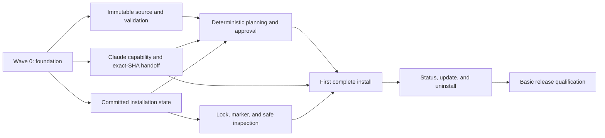

# AI4J — MVP Implementation Plan

| Field | Value |
|---|---|
| Status | Proposed implementation sequence |
| Scope | MVP only |
| Source baseline | [MVP requirements](MVP_REQUIREMENTS.md) |
| Backlog | [26 MVP stories plus 2 capabilities deferred to v1](stories/) |
| Planning model | Seven exit-gated waves with parallel work streams |
| Estimation | Relative size and dependency order; no calendar commitment |
| Last revised | 2026-08-24 |

## 1. Purpose

This plan orders the MVP stories around runnable vertical behavior. A modifying lifecycle begins only after source provenance, Claude capability, ownership, locking, and interrupted-operation safeguards exist.

The waves are delivery gates, not calendar sprints. A later wave may be prototyped early, but it must not be integrated or treated as complete until the preceding wave's exit gate passes.

## 2. Estimation model

Story sizes are relative:

| Size | Meaning |
|---|---|
| S | Narrow change with one primary boundary and limited fixtures |
| M | One cohesive capability with several normal and failure cases |
| L | Cross-package capability or external contract with substantial integration coverage |
| XL | Lifecycle or qualification story that joins several established components and requires broad failure testing |

No calendar commitment is assigned because contributor availability and access to the supported Claude/macOS compatibility matrix are not yet known. With one engineer, follow the listed dependency order. With multiple engineers, use the parallel lanes described in each wave.

Story status `Defined` means the story is refined and traceable. It becomes startable only after every `Depends on` story is complete and its wave entry conditions are satisfied.

### MVP execution guardrails

- Optimize for completed end-to-end behavior and test only explicit requirements and acceptance criteria.
- Spend at most 20% of a wave on architecture and review; record adjacent risks in `BACKLOG.md` instead of expanding the current slice.
- Do not add a shared abstraction unless the current acceptance criterion cannot be met without it.
- Do not spend more than 90 minutes on one story without explicit approval.
- At 80% of the available budget, stop expanding scope and finish, test, and deliver the runnable slice.
- Partial foundations do not complete a story or wave.

## 3. Delivery strategy

Immutable source, Claude capability, committed state, and interruption safeguards converge before the first install:



The mandatory delivery spine is the convergence of immutable source/rendering, qualified Claude-native behavior, and crash-safe mutation/recovery. A failure to prove exact-SHA handoff or no implicit execution is an MVP go/no-go result, not a reason to bypass the native contract.

## 4. Wave plan

### Wave 0 — Foundation and risk retirement

**Goal:** establish the product/toolchain contracts, internal architecture, and command surface.

| Story | Size | Role |
|---|---:|---|
| [MVP-ST-001 — Establish the Go module and CI foundation](stories/MVP-ST-001-go-module-and-ci-foundation.md) | M | Repository and build baseline |
| [MVP-ST-002 — Establish the typed MVP core and extension registry](stories/MVP-ST-002-typed-core-and-extension-registry.md) | L | Core ports, types, fakes, and architecture checks |
| [MVP-ST-003 — Publish the CLI, JSON, and exit-code contracts](stories/MVP-ST-003-cli-json-and-exit-contracts.md) | M | Stable user and automation contract |

**Order and parallelism**

1. Complete MVP-ST-001 first.
2. Complete MVP-ST-002 against that module foundation.
3. Complete MVP-ST-003 against the typed result model from MVP-ST-002.
4. Drafting for MVP-ST-012 and the release workflow skeleton from MVP-ST-028 may proceed in parallel, but those stories close only in Waves 1 and 6 respectively.

**Exit gate**

- A clean checkout builds a minimal `ai4j` with the pinned toolchain.
- CLI and version JSON schemas validate.
- Architecture dependency tests and fake ports pass.

### Wave 1 — Secure read-only validation

**Goal:** deliver `ai4j validate` over immutable disposable GitHub source without executing repository content or creating durable product state.

| Story | Size | Role |
|---|---:|---|
| [MVP-ST-004 — Build Darwin host and private runtime primitives](stories/MVP-ST-004-darwin-host-and-private-runtime.md) | L | Filesystem, process, permissions, and limits |
| [MVP-ST-005 — Detect a supported environment and Claude capability profile](stories/MVP-ST-005-environment-and-claude-capabilities.md) | L | Native integration risk gate |
| [MVP-ST-006 — Select and canonicalize a GitHub source](stories/MVP-ST-006-canonical-github-source.md) | M | Source identity and default selection |
| [MVP-ST-007 — Resolve immutable Git references and provenance](stories/MVP-ST-007-immutable-git-provenance.md) | L | Exact commit and update semantics |
| [MVP-ST-008 — Manage private ephemeral source workspaces](stories/MVP-ST-008-ephemeral-source-workspaces.md) | L | Acquisition, cleanup, and scavenging |
| [MVP-ST-009 — Validate the toolkit and native package contract](stories/MVP-ST-009-toolkit-package-validation.md) | L | Manifest and native package validation |
| [MVP-ST-010 — Enforce closed content roots and filesystem safety](stories/MVP-ST-010-content-roots-and-filesystem-safety.md) | L | Path, file, collision, and TOCTOU safety |
| [MVP-ST-011 — Validate MCP, executable, and secret declarations statically](stories/MVP-ST-011-mcp-executable-and-secret-validation.md) | M | Active-code and secret boundary |
| [MVP-ST-012 — Ship the first-party default toolkit](stories/MVP-ST-012-first-party-default-toolkit.md) | M | Validated representative product content |
| [MVP-ST-013 — Disclose active content and guarantee no implicit execution](stories/MVP-ST-013-active-content-disclosure-and-no-execution.md) | M | Trust disclosure and execution boundary |

**Dependency-aware parallel lanes**

- **Host/Claude lane:** MVP-ST-004 provides a zero-write read-only Bootstrap to MVP-ST-005; the mutation Bundle is a separate post-approval transition and is not the continuation used by `validate`.
- **Source lane:** MVP-ST-006 can start with MVP-ST-004; MVP-ST-007 waits for both, then MVP-ST-008 follows.
- **Validation lane:** after MVP-ST-004, MVP-ST-010.T1 establishes canonical path and collision-key contracts while MVP-ST-009.T1–T3 proceeds after MVP-ST-005. MVP-ST-010.T1 gates MVP-ST-009.T4; MVP-ST-009.T3 gates MVP-ST-010.T2–T5. MVP-ST-009.T4 and MVP-ST-010.T5 then gate MVP-ST-011.T1–T6.
- **Trust/native-validation join:** MVP-ST-009.T4 and MVP-ST-011.T6 gate MVP-ST-013.T1–T5. The no-execution grant from MVP-ST-013.T5 must exist before MVP-ST-009.T5 may invoke a Claude validator; MVP-ST-009.T5–T6 then completes native validation without creating a dependency cycle.
- **Content lane:** draft MVP-ST-012 from Wave 0, then close it after MVP-ST-009.T6 and MVP-ST-011.T6. Its first-party fixture also exercises the disclosure aggregation already established by MVP-ST-013.T1–T3.
- **Validate convergence:** MVP-ST-013.T6 joins MVP-ST-008, MVP-ST-009.T6, and MVP-ST-012.T6 to complete `ai4j validate`.

Drafts and fixtures may overlap freely, but a story starts as executable work only when its metadata dependencies are complete. The user-visible `validate` command is integrated only after all lanes converge.

**Exit gate**

- Public, private, omitted-default, and explicit-default validation works.
- Every reference resolves to typed exact provenance in a clean detached workspace.
- Malicious metadata, paths, files, modes, secrets, and limits fail closed.
- The complete first-party toolkit passes AI4J and supported Claude validation and remains bounded by closed content roots.
- Every normal or handled read-only result removes temporary source and creates no durable product/target state.
- Environment preflight closes its zero-write Bootstrap before MVP-ST-008 creates the distinct invocation-scoped transient read runtime; no read-only path activates the mutation Bundle or creates an absent Claude configuration directory.
- Process and network sentinels prove that validation and native validation start no toolkit content.

### Wave 2 — Complete lifecycle planning

**Goal:** finish the three runnable, non-mutating lifecycle previews needed before the first real install.

| Story | Size | Role |
|---|---:|---|
| [MVP-ST-014 — Render the exact-commit Claude catalog](stories/MVP-ST-014-sha-pinned-catalog-and-native-handoff.md) | S | Deterministic exact-SHA catalog |
| [MVP-ST-015 — Store one installation ownership record](stories/MVP-ST-015-installation-state-and-atomic-reads.md) | M | Versioned ownership snapshot |
| [MVP-ST-016 — Preview install, update, and uninstall](stories/MVP-ST-016-complete-lifecycle-plans.md) | M | Runnable lifecycle plans |

**Exit gate**

- Install, update, and uninstall plans run through the production command dispatcher and remain non-mutating.
- Plans disclose the exact commit, active content, deterministic actions, warnings, conflicts, and expected state in human and JSON form.
- The generated catalog pins the plugin to the planned full commit, and stored ownership snapshots are versioned, bounded, secret-free, and atomically replaced.
- Pinned, unchanged, fast-forward, rewritten-reference, native-identity, and owned-file conflict cases are covered.

### Wave 3 — First complete installation

**Goal:** install the first-party toolkit through Claude while directly owning only the catalog, rule file, and private management state.

| Story | Size | Role |
|---|---:|---|
| [MVP-ST-017 — Apply only an approved, reviewed plan](stories/MVP-ST-017-approval-and-reviewed-commit.md) | M | Approval and expected-commit guard |
| [MVP-ST-018 — Serialize modifying commands](stories/MVP-ST-018-mutation-locking-and-consistent-reads.md) | M | Single bounded OS lock |
| [MVP-ST-019 — Record an interrupted operation](stories/MVP-ST-019-durable-operation-journal.md) | M | Minimal operation marker |
| [MVP-ST-020 — Reconcile an interrupted operation](stories/MVP-ST-020-post-mutation-reconciliation.md) | M | Inspect or report recovery required |
| [MVP-ST-022 — Manage the dedicated shared-rules resource](stories/MVP-ST-022-dedicated-shared-rules.md) | M | Owned rules write/remove |
| [MVP-ST-023 — Install and idempotently reconcile the user toolkit](stories/MVP-ST-023-install-and-idempotent-reconciliation.md) | XL | First complete vertical lifecycle |

**Order and parallelism**

- MVP-ST-023 joins the completed source, plan, catalog, state, lock, marker, approval, recovery-inspection, and rules behavior.
- Continue building failure fixtures and release automation in parallel; do not wait until Wave 6 to start tests.

**Exit gate**

- After normalizing invocation-scoped operation IDs, installation IDs, and timestamps, clean-profile omitted-source and explicit-equivalent installs converge on the same package commit and desired state except for `sourceSelection`.
- The persistent catalog survives source cleanup and carries the reviewed exact SHA.
- Reinstall is `no_change` and preserves the installation ID.
- Every handled installation failure either proves no persistent effect or retains the operation marker and reports `recovery_required`.
- No install path starts first-party MCP or executable content.

### Wave 4 — Inspection and update awareness

**Goal:** expose trustworthy local state and optional remote update disposition without repair or execution.

| Story | Size | Role |
|---|---:|---|
| [MVP-ST-024 — Inspect installation, drift, and updates](stories/MVP-ST-024-status-drift-and-update-check.md) | M | Status, drift, recovery, and update awareness |

**Parallel work**

- Native observation fixtures, adapter-owned drift fixtures, and remote Git disposition fixtures can be implemented concurrently.
- Update and uninstall teams may begin design against the committed status/current-state model but should not duplicate its inspection logic.

**Exit gate**

- Plain status is local, non-executing, and non-mutating.
- Update checking uses an ephemeral workspace and reports every branch/tag/commit/error disposition precisely.
- Recorded intent, documented native registration/installation/enablement observations, owned-file drift, and recovery states remain distinct; unsupported native facts remain `not_observable`.

### Wave 5 — Update and uninstall

**Goal:** complete both remaining modifying lifecycle paths using the same planner, lock, marker, inspection, and ownership checks as install.

| Story | Size | Role |
|---|---:|---|
| [MVP-ST-025 — Update tracked branches without rewriting history](stories/MVP-ST-025-fast-forward-update.md) | XL | Fast-forward update lane |
| [MVP-ST-026 — Uninstall without touching unrelated state](stories/MVP-ST-026-conservative-uninstall.md) | L | Conservative removal lane |

**Parallel lanes**

- MVP-ST-025 and MVP-ST-026 can be implemented in parallel after Wave 4.
- Each lane must use independent fixtures while reusing the shared planner and mutation executor.
- Shared lifecycle changes require both lanes' focused tests before merge.

**Exit gate**

- Branches update only to validated fast-forward exact commits; pins do not move.
- Update discloses active-content changes before mutation.
- Every uninstall ownership/drift check finishes before the first removal.
- A successful uninstall removes the owned registration for future loads and checksum-proven adapter resources; unrelated state survives, while current-session activity is reported as unknown/not revoked until reload or restart.

### Wave 6 — Cross-product and release qualification

**Goal:** converge story-owned acceptance evidence, then publish and verify the basic MVP artifact on the supported clean host.

| Story | Size | Role |
|---|---:|---|
| [MVP-ST-028 — Distribute a verified clean-host MVP release](stories/MVP-ST-028-release-qualification-and-distribution.md) | XL | Release and launch gate |

MVP-ST-028 runs the story-owned lifecycle and no-execution checks on the supported macOS, Git, and Claude versions. It does not add cross-host reproducibility work, which belongs to v1, or signing, notarization, SBOM, and attestation work, which remains post-v1.

**Exit gate**

- The pinned toolchain builds the `darwin/arm64` binary from locked dependencies.
- The published binary, version output, and SHA-256 checksum agree.
- The artifact passes the clean-host lifecycle and supported-Claude contract checks.
- All 17 MVP acceptance criteria pass.

## 5. Mandatory dependency spine and parallel capacity

Calendar-critical work cannot be identified without capacity and duration data. The mandatory dependency spine and joins are:

```text
source:
MVP-ST-001 -> MVP-ST-002 -> {MVP-ST-004, MVP-ST-006}
{MVP-ST-004, MVP-ST-006} -> MVP-ST-007 -> MVP-ST-008

Claude qualification:
MVP-ST-004 -> MVP-ST-005
{MVP-ST-005, MVP-ST-007, MVP-ST-009, MVP-ST-010, MVP-ST-013} -> MVP-ST-014

Wave 1 validation and trust joins:
MVP-ST-004 -> MVP-ST-010.T1
MVP-ST-005 -> MVP-ST-009.T1 -> MVP-ST-009.T2 -> MVP-ST-009.T3
MVP-ST-010.T1 -> MVP-ST-009.T4
MVP-ST-009.T3 -> MVP-ST-010.T2 -> MVP-ST-010.T3 -> MVP-ST-010.T4 -> MVP-ST-010.T5
{MVP-ST-009.T4, MVP-ST-010.T5} -> MVP-ST-011.T1 -> ... -> MVP-ST-011.T6
{MVP-ST-009.T4, MVP-ST-011.T6} -> MVP-ST-013.T1 -> ... -> MVP-ST-013.T5
MVP-ST-013.T5 -> MVP-ST-009.T5 -> MVP-ST-009.T6
{MVP-ST-009.T6, MVP-ST-011.T6} -> MVP-ST-012.T1 -> ... -> MVP-ST-012.T6
{MVP-ST-008, MVP-ST-009.T6, MVP-ST-012.T6, MVP-ST-013.T5} -> MVP-ST-013.T6

state/interruption safety:
MVP-ST-013 -> MVP-ST-015 -> MVP-ST-018 -> MVP-ST-019 -> MVP-ST-020

rules:
{MVP-ST-005, MVP-ST-010, MVP-ST-015, MVP-ST-018} -> MVP-ST-022

planning and lifecycle convergence:
{MVP-ST-013, MVP-ST-014, MVP-ST-015} -> MVP-ST-016
{MVP-ST-016, MVP-ST-018} -> MVP-ST-017
{MVP-ST-012, MVP-ST-014, MVP-ST-017, MVP-ST-019, MVP-ST-020, MVP-ST-022} -> MVP-ST-023
MVP-ST-023 -> MVP-ST-024 -> {MVP-ST-025, MVP-ST-026}
{MVP-ST-025, MVP-ST-026} -> MVP-ST-028
```

Recommended parallel capacity:

| Lane | Earliest start | Continues through | Notes |
|---|---|---|---|
| Core/CLI | Wave 0 | Wave 3 | Owns types, schemas, planner integration, and command behavior |
| Host/source | Wave 1 | Wave 5 | Owns Darwin safety, Git identity, exact refs, and ephemeral acquisition |
| Claude adapter | Wave 1 | Wave 5 | Starts with capability proof; owns native validation, handoff, inspection, and lifecycle contracts |
| State/recovery | Wave 2 | Wave 6 | Owns atomic state, the single lock, the operation marker, safe inspection, and cleanup |
| First-party content | Wave 0 | Wave 6 | Maintains valid content plus malicious and compatibility fixtures |
| Release engineering | Wave 0 | Wave 6 | Adds CI incrementally; MVP qualification closes only at the end |

With fewer contributors, preserve the dependency order rather than skipping a lane. In particular, qualify the documented Claude operations before building install.

## 6. Common definition of done

Every story is complete only when:

- Its story-level acceptance criteria pass with automated evidence at the appropriate test boundary.
- Human and JSON behavior agree with the canonical command/result model.
- New errors have stable codes and contain no secret or unbounded opaque output.
- Relevant normal, invalid, conflict, timeout, cancellation, process-death, and concurrent-change paths are covered.
- Architecture boundaries remain enforced and no v1-only capability becomes registered.
- Documentation and schemas are updated in the same change.
- No required test is skipped or quarantined.
- Repository author/committer and publishing policy checks pass.

## 7. Requirement coverage

### Architecture and functional requirements

| Requirement | Primary stories |
|---|---|
| MVP-AR-01 | MVP-ST-005, MVP-ST-014 |
| MVP-AR-02 | MVP-ST-008, MVP-ST-015, MVP-ST-022, MVP-ST-023, MVP-ST-026 |
| MVP-AR-03 | MVP-ST-009, MVP-ST-012, MVP-ST-014 |
| MVP-AR-04 | MVP-ST-002 |
| MVP-FR-01 | MVP-ST-005, MVP-ST-028 |
| MVP-FR-02 | MVP-ST-006, MVP-ST-012 |
| MVP-FR-03 | MVP-ST-007, MVP-ST-025 |
| MVP-FR-04 | MVP-ST-008 |
| MVP-FR-05 | MVP-ST-009, MVP-ST-011, MVP-ST-012 |
| MVP-FR-06 | MVP-ST-004, MVP-ST-010 |
| MVP-FR-07 | MVP-ST-013, MVP-ST-016 |
| MVP-FR-08 | MVP-ST-003, MVP-ST-011, MVP-ST-013, MVP-ST-014, MVP-ST-016, MVP-ST-023, MVP-ST-024, MVP-ST-025, MVP-ST-026, MVP-ST-028 |
| MVP-FR-09 | MVP-ST-016, MVP-ST-017 |
| MVP-FR-10 | MVP-ST-014, MVP-ST-023 |
| MVP-FR-11 | MVP-ST-022 |
| MVP-FR-12 | MVP-ST-011, MVP-ST-012 |
| MVP-FR-13 | MVP-ST-025 |
| MVP-FR-14 | MVP-ST-024 |
| MVP-FR-15 | MVP-ST-026 |
| MVP-FR-16 | MVP-ST-015 |
| MVP-FR-17 | MVP-ST-018, MVP-ST-019, MVP-ST-020 |
| MVP-FR-18 | MVP-ST-019, MVP-ST-020 |
| MVP-FR-19 | MVP-ST-011 |
| MVP-FR-20 | MVP-ST-017, MVP-ST-023 |

### Non-functional requirements

| Requirement | Primary stories |
|---|---|
| MVP-NFR-01 | MVP-ST-007, MVP-ST-009, MVP-ST-014, MVP-ST-015, MVP-ST-028 |
| MVP-NFR-02 | MVP-ST-004, MVP-ST-008, MVP-ST-010, MVP-ST-015, MVP-ST-019 |
| MVP-NFR-03 | MVP-ST-004, MVP-ST-009, MVP-ST-028 |
| MVP-NFR-04 | MVP-ST-003, MVP-ST-011, MVP-ST-013, MVP-ST-019, MVP-ST-028 |
| MVP-NFR-05 | MVP-ST-010, MVP-ST-018, MVP-ST-020, MVP-ST-023, MVP-ST-025 |
| MVP-NFR-06 | MVP-ST-001, MVP-ST-028 |
| MVP-NFR-07 | MVP-ST-002, MVP-ST-005, MVP-ST-014, MVP-ST-020, MVP-ST-028 |
| MVP-NFR-08 | MVP-ST-001, MVP-ST-002, MVP-ST-028 |

### Acceptance coverage groups

| MVP acceptance criteria | Primary stories |
|---|---|
| 1 | MVP-ST-006, MVP-ST-007 |
| 2 | MVP-ST-007, MVP-ST-016, MVP-ST-025 |
| 3 | MVP-ST-009, MVP-ST-010, MVP-ST-011 |
| 4 | MVP-ST-013 |
| 5 | MVP-ST-014, MVP-ST-016 |
| 6 | MVP-ST-014, MVP-ST-015, MVP-ST-017 through MVP-ST-023 |
| 7 | MVP-ST-025 |
| 8 | MVP-ST-024 |
| 9 | MVP-ST-026 |
| 10 | MVP-ST-013, MVP-ST-023, MVP-ST-025, MVP-ST-026 |
| 11 | MVP-ST-011, MVP-ST-015, MVP-ST-019, MVP-ST-023 |
| 12 | MVP-ST-015, MVP-ST-017, MVP-ST-018, MVP-ST-022, MVP-ST-023, MVP-ST-025, MVP-ST-026 |
| 13 | MVP-ST-019, MVP-ST-020, MVP-ST-023 |
| 14 | MVP-ST-008 |
| 15 | MVP-ST-003 and every command-owning lifecycle story |
| 16 | MVP-ST-012 |
| 17 | MVP-ST-001, MVP-ST-028 |

No architecture, functional, non-functional, or numbered MVP acceptance requirement is intentionally left without a primary story.

## 8. Planning risks and decision gates

| Risk | Earliest proving story | Decision gate |
|---|---|---|
| Claude cannot consume or preserve the exact-SHA declaration through a supported non-executing flow | MVP-ST-014 | Stop MVP lifecycle implementation; do not bypass the native interface |
| Claude mutators lack reliable machine-readable completion evidence | MVP-ST-014 | Qualify exit behavior and reconcile through documented inspection, or mark capability unsupported |
| Native install/update/uninstall may execute plugin content indirectly | MVP-ST-014 | Fail the capability profile; no lifecycle integration or release support for that version |
| An interrupted native result cannot be determined from documented inspection | MVP-ST-020, MVP-ST-023 | Retain the marker, report `recovery_required`, and perform no new mutation |
| Uninstall native semantics could remove unrelated user data | MVP-ST-026 | Preserve unrelated data through a qualified supported option or treat uninstall as unsupported |
| Default repository is not anonymously readable at launch | MVP-ST-028 | Explicitly document and clean-host test the existing-Git-auth prerequisite |

## 9. Change control

- If a story changes a normative requirement, update `MVP_REQUIREMENTS.md` first and review the impact on every downstream story and wave gate.
- If a story introduces a post-MVP target, host, scope, source mode, selection mode, cache, or durable history behavior, reject it or move it to the v1 backlog.
- If a story cannot meet its exit gate through documented Claude interfaces, record the capability as unsupported rather than weakening provenance, ownership, no-execution, or recovery guarantees.
- Changes to story dependencies or wave assignment must preserve the convergence streams and dependency joins described in this plan.
